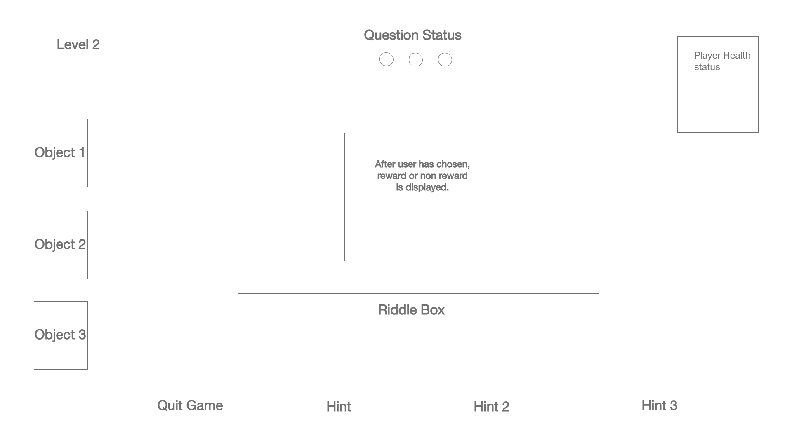
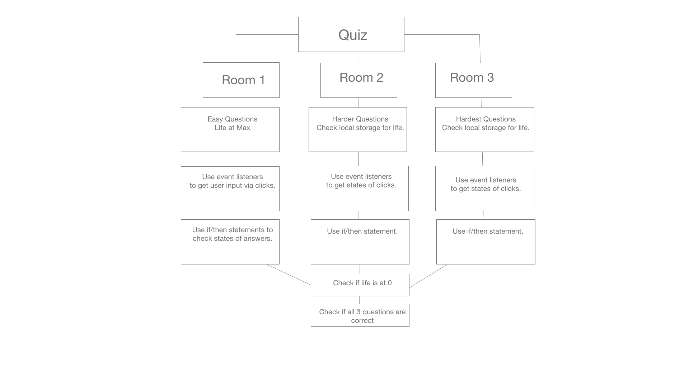

# escape-room-game

- a short, horror themed, point and click adventure.

## Wireframe

## User Story

- <https://trello.com/b/pA6ibMhR/escape-from-carebear-hell>

## Domain Model

## Music and Sound Effects provided by

1. <https://www.fesliyanstudios.com/royalty-free-music>
1. <http://www.orangefreesounds.com/>
1. Private Hell Productions
1. https://www.bensound.com/
1. little girl talking effect by: <https://www.youtube.com/watch?v=dTc20bVT180>

## Photos provided by
- Unsplash
  1. Thanks to Mikhail Elfimov for sharing their work on Unsplash. Dark room with silhouette.
  1. Thanks to Jonathan Borba for sharing their work on Unsplash. 
  1. Thanks to Ivan Yeo for sharing their work on Unsplash.
  1. Thanks to Harmanjot Kaur for sharing their work on Unsplash.
  1. Thanks to Robert Zunikoff for sharing their work on Unsplash.
  1. Thanks to Alfred Leung for sharing their work on Unsplash.
  1. Vectezy icon graphics
  1. 

## Creators

- Keith Musig - Graphic Design/HTML/CSS/JavaScript
- Michael Eclavea - JQuery/Voice Acting/HTML/CSS/JavaScript/codepenIO
- Sara Strasner - Documentation/HTML/CSS/JavaScript
- Kevin McNeil - HTML/CSS/Javascript/Band Names/Snacks